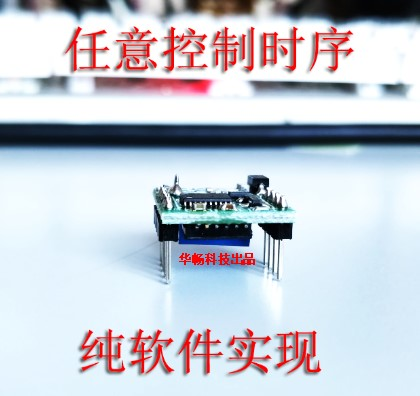

# 触发延时模块使用说明

* [通用说明](common.md)
* [边沿触发型说明](edge.md)
  

## 简介
`触发延时控制模块` 为`华畅科技`研发的一款为方便各类控制系统集成化实验管理而提供的一款高性价比的数字编程控制模块。

该模块采用单片机编程控制引脚，可以实现任意触发逻辑和输出逻辑。能够实现通常靠模拟芯片电路无法实现的时序控制。

自模块推出以来已经成功为各个客户提供了数以万计的定制开发模块，欢迎有独特需求的客户垂询。
## 电气参数
* 工作电压：5V-25V
* 最大输出电流：1.5A
  
## 可选扩展功能
* 脉宽检测型
* 计数触发型
* 电压监控型
* MODBUS控制型
