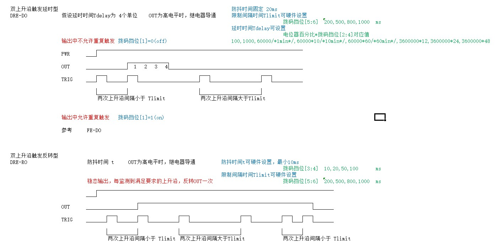
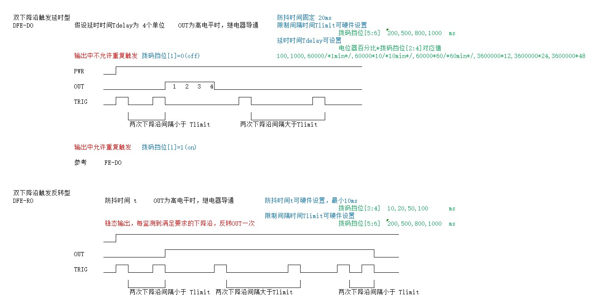

# 边沿触发型控制模块使用说明

## 边沿触发输出
边沿触发类型的模块在输出控制时，可以选择为
* 延时型
* 反转型

### 1. 延时型
延时型对应于数字电路的暂态，在延时一段时间后，恢复到初始状态。

延时型控制模块根据是否允许重复触发，还可以分为
* 允许重复触发
* 不允许重复触发

#### 触发中允许重复触发
延时过程中，再次触发重置定时器

#### 触发中不允许重复触发
延时过程中，再次触发被忽略

### 2. 反转型
反转型对应于稳态，即输出到某一状态后，无外部触发事件时，不会发生状态改变。

----------------------
## 多沿触发型
多沿触发型定义为，为了防止误触发或其他控制逻辑需要，满足在指定时限内发生的多次沿检测。

可以用于开关等场合。

----------------------
## 下降沿触发时序

## 上升沿触发时序

## 双上升沿触发时序

## 双下降沿触发时序
