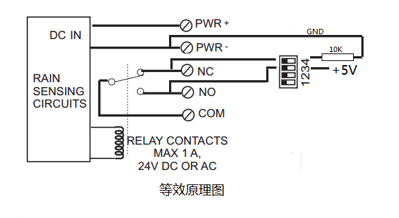

# RS-01光学雨量传感器

[购买链接](https://item.taobao.com/item.htm?spm=a1z10.5-c-s.w4002-21232361946.12.620112aaXIKw6l&id=610161920978)

## 产品描述
光学雨量传感器采用光学感应原理测量降雨量。

内置多个光学探头，匹配可靠的检测算法，确保雨量测量的准确有效。

区别于传统的机械式传感器，光学雨量传感器更小，更灵敏，更智能，更容易维护。

该产品支持开机校准和安装错误提醒，支持开关量和UART输出。

防水等级： IP66 完全防止外物嵌入且可以完全防止灰尘进入。

承受猛烈海水冲击或喷水时，不会收到有害损坏。

## 产品特点

## 安装说明

1. 确认您的工作模式，并通过拨码开关来选择  
   >说明书后页将详细描述工作模式和拨码选择方式。
2. 固定安装雨量传感器  
   >需要把雨量传感器安装在一个上方空旷的地方，不能有遮挡物遮挡。  
	安装固定臂沟槽宽19mm，长度51mm，带2个直径6.35mm的通孔，间距19mm。  
	信号导线通过传感器下方的防水孔引出，请务必确认使用室外用的防水密封线。  
	对于某些安装在管道里的应用场景，可以用电钻去掉安装固定臂。  
3. 根据左图组装雨量传感器
   >拉拽几次防水垫圈，这样安装时就能很容易贴合。也可以在防水垫圈和螺丝上涂些防水硅脂。  

**雨量传感器在安装之前必须保证罩子表面是干燥的。任何的水汽水滴都会导致测量误差。你可以选择性的使用一些干燥剂放在里面。如果雨量传感器没法及时排出存水，可以在罩子底部钻一个3mm直径的小孔辅助排水。**

## 使用警告

不要在任何会因传感器指示错误而导致生命或物资损毁的地方使用雨量传感器。确保容错性，不因为一个组件发生错误（包括RS-01雨量传感器）就导致灾难性的后果，这是系统设计师或者系统集成商的责任。

<h3 style="color:red">本公司不承担任何因为传感器指示错误而导致的相关后果。</h3>

------------------------------------------

# 外型尺寸图

## 接线示意图

## 等效原理图

## 指标参数
| 参数                  | 值          |
|---------------------|------------|
| 供电电压                | 9V ~ 30VDC |
| 工作电流                | 22mA@12VDC |
| 输出                  | 继电器闭合     |
| |通过拨码位3，4可以选择成5V脉冲输出 |
| 最大负载 |24VDC，1A       |
| 工作温度                | -40℃ ～ 60℃ |
| 精度                  | ±15%       |
| 单位量程                | 0.2mm      |
| 最大瞬时雨量              | 0.4mm/s    |
| UART参数              | 115200 8N1 |

## 软硬件版本
此说明书仅用于V9版本雨量传感器。版本号打印于电路板背面。

## 指示LED
电路板正面中间的LED在开机时校准时点亮，校准通过完毕后熄灭。如果校准过程中，整体误差过大，则一直不熄灭。此时需要检查罩子是否盖紧牢靠，或者更换罩子。

正常工作时，在有效输出时点亮。

## 输出波形

## 拨码开关说明

通过拨码开关可以选择雨量传感器的工作模式，以及输出功能。拨码选择功能，仅在上电时读入配置。  
	拨码位1，2选择了当前的工作模式：测雨模式，测雨低功耗模式，感雨模式。  
		拨码位3，4 选择了输出功能：继电器输出模式，脉冲输出模式。  
	下表中， 1代表打开（ON），0代表关闭（OFF），X代表任意位置  

* 测雨模式  
测雨模式下，每累积0.2mm降雨，输出一个有效脉冲  

| b1 | b2 | b3 | b4 |
|----|----|----|----|
| 0  | 0  | x  | x  |

* 低功耗模式  
为降低功耗，雨量传感器将周期性的开启检测功能，无降雨时处于休眠状态。测量精度低于正常测雨模式。  
★低功耗模式仅在测雨模式下有效  

| b1 | b2 | b3 | b4 |
|----|----|----|----|
| 0  | 1  | x  | x  |

* 感雨模式
感雨模式下，每感知到雨滴，输出有效脉冲1分钟。1分钟后，每10秒内，如果检测到有雨滴下落，则持续输出，否则终止输出。

| b1 | b2 | b3 | b4 |
|----|----|----|----|
| 1  | 0  | x  | x  |

* 工厂模式
仅用于工厂测试，请勿使用

| b1 | b2 | b3 | b4 |
|----|----|----|----|
| 1  | 1  | x  | x  |

* 继电器输出模式

| b1 | b2 | b3 | b4 |         |
|----|----|----|----|---------|
| x  | x  | 0  | 0  | 继电器输出模式 |

>COM：继电器公共端  
NO： 当雨量达到量程时，NO引脚将与COM吸合导通，NC与COM断开  
NC： 继电器默认吸合引脚 ，雨量未达到量程时，与COM导通。  

* 脉冲输出模式
  
通过拨码切换，连接内部5V，进而实现脉冲输出  

| b1 | b2 | b3 | b4 |        |
|----|----|----|----|--------|
| x  | x  | 1  | 1  | 脉冲输出模式 |

>COM： 不使用  
		NO：脉冲信号（5V 50ms）输出端子  
		NC： GND  

------------------------------------
## AT命令说明
    使用背部UART扩展接口进行通信。 TTL电平。
    ★ <LF>代表换行“\n”

1. 获取上电开始到当前时间的脉冲计数值。传感器保存的最大脉冲计数值为 4,294,967,295，请勿超限，重新上电将清零。
   
			命令格式：? <LF>
			应答格式：		
						1<LF>			//当前计数值
								
2. 清除脉冲计数值，设置为0
   
			命令格式： /<LF>
			应答格式：		
						OK<LF>		
