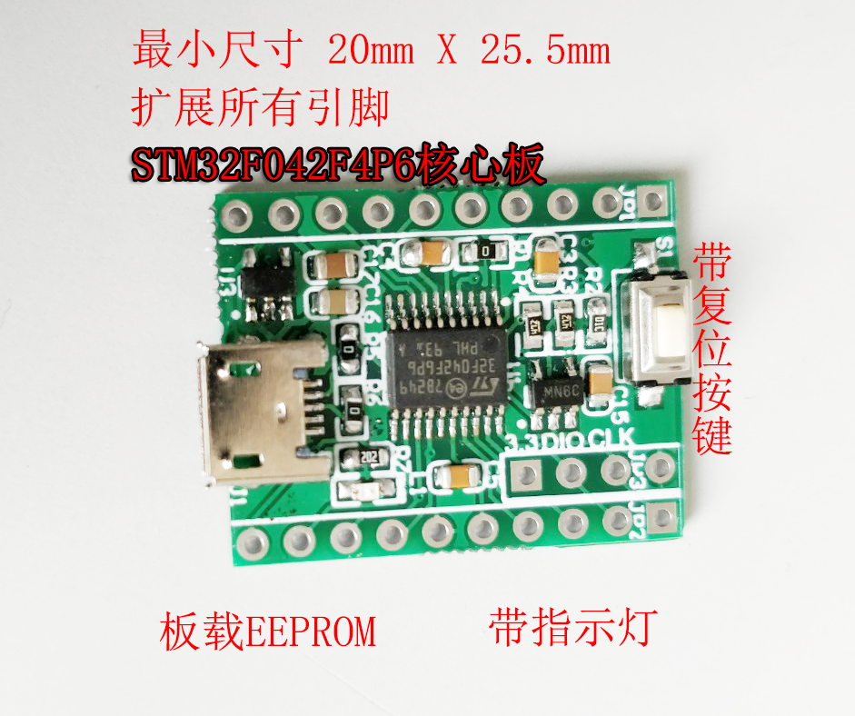
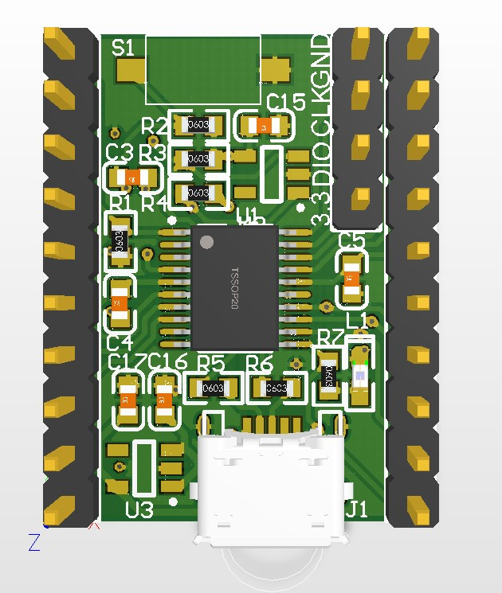
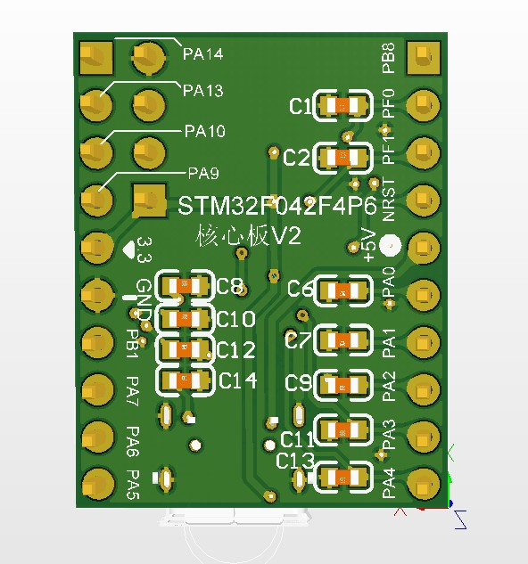
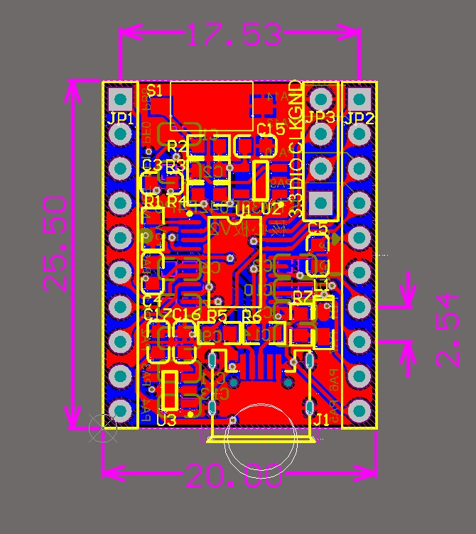
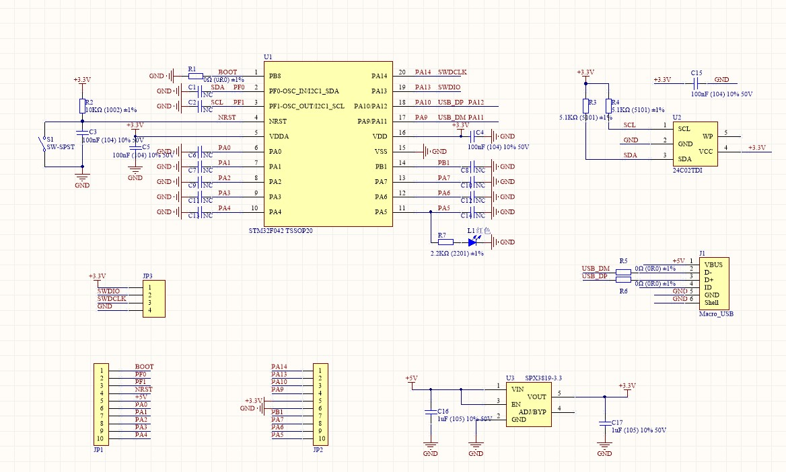

<h1>
STM32f042核心板是为 具备一定开发能力的倾向于USB设备开发者提供的最小系统板。</h1>

--------------------------------

# 简介
核心板扩展了所有引脚，并在PCB上最大程度的增加可选扩展项。

板载一颗I2C总线的EEPROM 24C02， 用于存储遗失数据。

板载一个5V转3.3V 500mA LDO，用于向MCU供电，并可以通过扩展引脚向外供电。

# 参数
    1. 全网超小尺寸：20mm X 25.5mm
    2. 3.3V驱动能力：500mA

# 技术支持
关于技术支持， 仅提供 一套测试代码（基于stm32cube），用于测试硬件。 
>**无其他任何技术支持，入门新手慎拍。**

# 发货功能
连接设备至电脑，短接PB1 与GND， 鼠标指针画菱形。可以恶搞一下你的朋友。

# 其他
背面电容可以用于防抖或者延时等需求，发货时不焊接

不需要USB功能，可以去掉电阻R5，R6

需要使用 PB8（BOOT）引脚，去掉电阻R1或更换阻值

需要外接晶振，去掉R3，R4和U2（24c02），在背面可以焊接晶振和匹配电容

# 效果图与尺寸

# 原理图
