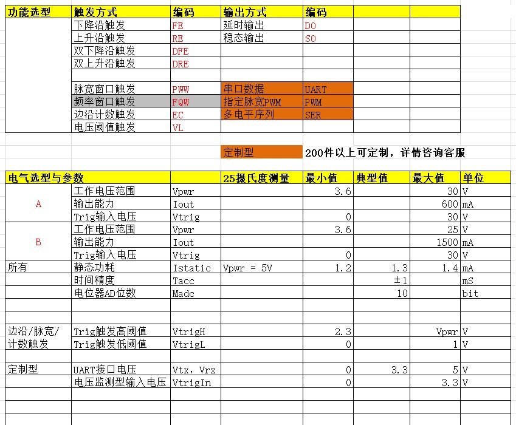

# 通用说明
 限于模块体积，模块内部不包含`缓启动电路`，所以对于`超过15V`供电电压的使用条件下，需要额外注意，防止瞬间上电导致过激而烧毁LDO和内部元件。
  
  另外，此模块可用于继电器控制，以及1.5A内的负载驱动。 对于 `直流电机` 等 `启动电流特别大`的负载，不保证能100%可用。

# 引脚说明
相同标号的引脚在模块内部是直连，使用时选择一个即可。  
`Output` 引脚在内部是OD开漏电路，如果需要作为下一级数字电路输入，需要外接一个上拉电阻，通常10K欧姆。

  


## TX，RX  
 UART/RS485通信控制时使用的收发引脚，或者在多控应用中，第二，第三触发引脚。  
 `最大电压 5.5V`。  
## OUT
 输出端。从上图可以看出，OUT端子在内部有回流二极管连接到Power，这样就可以直接在Power与OUT端子之间驱动感性负载。对于有方向的负载一定要确认连接方向，Power连接正极，OUT连接负极。

 `最大电压 25V`。OUT端子最大驱动电流为`1.5A`。  
 如果要将OUT连接到单片机，需要在外部加上拉电阻到Vcc，理论上输出部分是开漏电路。  
 如果板载指示灯点亮，表示三极管导通，OUT将输出低电平。  
## Trig 
 触发输入端。  
 对于无触发需求的控制板，比如上电延时类的，可以忽略不使用。  
 `最大电压 25V`。  

 控制模块内部已经有10K上拉电阻到Power，所以默认上电后，不连接时，Trig引脚电压为Power。

## GND 电源负极。

## Power 电源正极。
`最大电压 25V`。对于 5-25V供电的模块， 内部带反接保护二极管。 `对于 2.95-5.5V供电的模块，内部不带反接保护，请务必确认供电方向`。

## 指示灯
指示灯点亮，表示驱动三极管导通，OUT端子可以接收输入电流。  
OUT接上拉电阻后，指示灯亮 代表低电平；指示灯灭 代表高电平。  

## 拨码
6位拨码 用于设置不同的功能，比如触发模式，延时时间，防抖时间等等。具体使用依赖于不同的功能。  
一般时间设置，比如 BIT[2:5] 用于设置延时时间，而延时数组为：

```c
uint32_t delay_ms[16] = {10,100,500, 1000,10000,30000,60000,120000,300000,600000,1800000,3600000,3600000*2,3600000*5,3600000*12,3600000*24}; //BIT[2:5]
```

比如要设置 1s的延时，那么 从延时数组里看，1s对应的索引为 3（从0开始数），BIT[2:5]就应该设置成 0011（二进制） 。1代表拨码ON， 0 表示拨码 OFF。

## 电位器
有些功能需要电位器参与，比如细调延时时间，电压门限报警。

以下降沿触发延时为例，电位器的滑动点比例值 * 拨码代表的延时时间 = 最终的延时时间。 所以如果要设置1s的延时，需要将电位器的阻值调整到最大，比例值100%。

**`电位器逆时针旋转，比例值增大， 顺时针选择比例值缩小`**。


# 其他
对于，多控，485控，遥控，电压门限控，计数控，多沿触发控 等定制需求，可以联系客服帮你分析一下。

# 电气参数



不尽详细之处请联系客服。谢谢