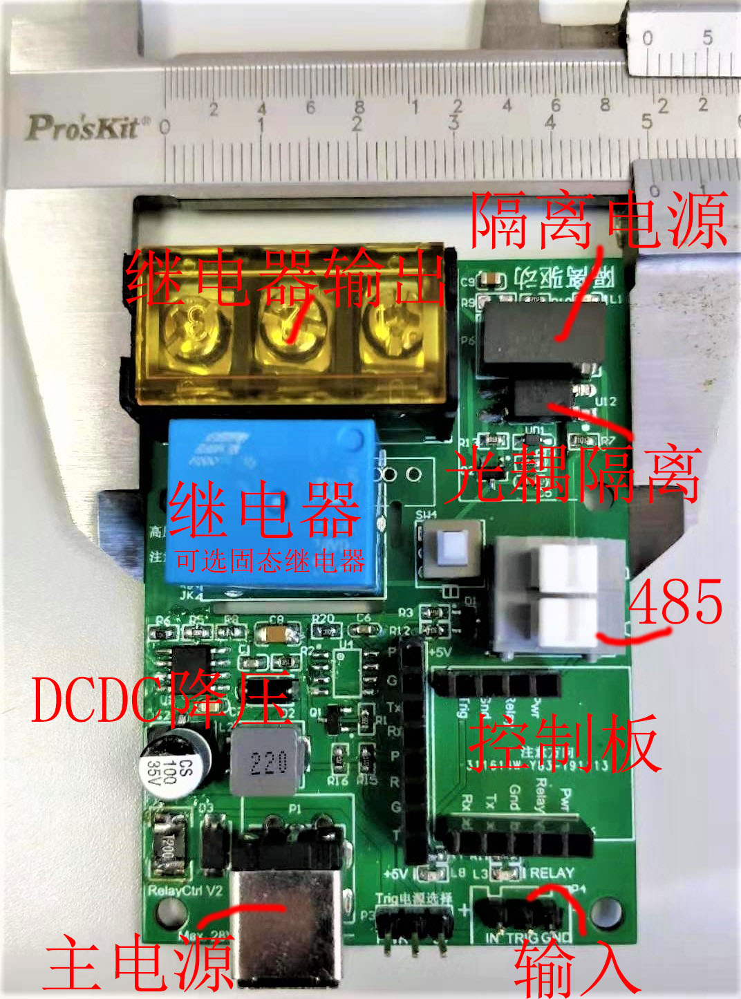
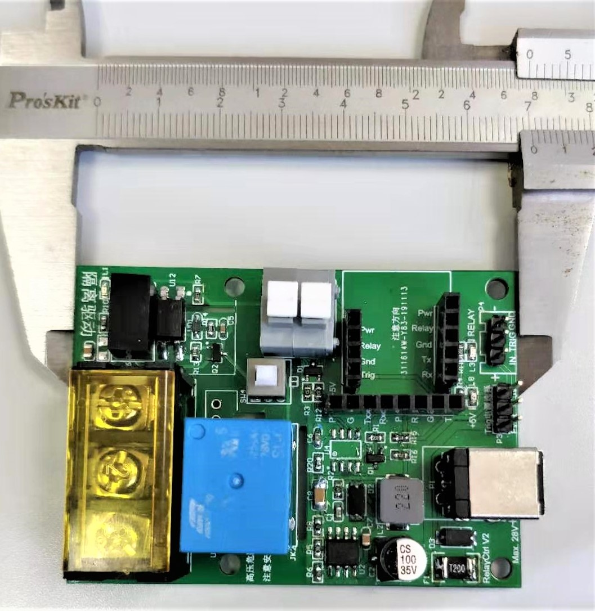

# 继电器控制板说明

这是一款用于配合[`触发延时控制模块`](common.md) 而使用的继电器控制模块。

## 尺寸 
    50mm * 70mm

## 电源部分
板载DCDC降压型5V输出电源，用于为`控制模块` 或其他传感器外设供电。

* 输入电压范围：7~28V
* 输出电压:5V
* 输出电流能力：3A

## RS485部分
板载USART TTL电平->RS485 电平转换电路，使`控制板`能够实现 基于 RS485的MODBUS协议，进而实现远程控制。

## 继电器控制部分
继电器可以选择2款继电器：

1. 机械触点继电器  SRD-05-SL-C  
    10A 250VAC  
    10A 30VDC
2. 固态继电器  
    H3MB  2A 50VDC  
    G3MB  2A 240VAC

继电器控制部分可选择：
 * 完全不隔离
 * 控制部分光耦隔离
 * 控制部分光耦隔离+控制供电隔离

## 输入部分
对外提供5V3A输出，或者输入电源直通，可以连接大部分传感器。
比如，按键，接近传感器，霍尔传感器，光电传感器，温度传感器等等。
详细选型，可以联系客服帮忙参考。